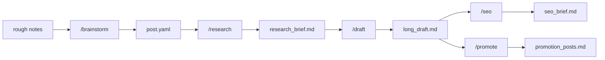

# Newsletter Engine

A repo-based, Claude-first writing system for creating blog and newsletter content. Specialised agents handle brainstorming, research, drafting, SEO, and promotion — coordinated by Claude across a predictable folder structure.

---

## Pipeline



Each skill is independently invocable. `/new-post` chains the full pipeline.

---

## Repo Structure

```
newsletter-engine/                        (M0)
├── .claude/
│   ├── CLAUDE.md                  # Session context and repo index
│   └── rules/                     # Behavioural rules, auto-loaded
├── README.md
├── reference-docs/
│   ├── prd-v1.md                  # Full product requirements
│   └── milestones-v1.md           # Milestone plan and definitions of done
├── reference_posts/               # Jose's real posts for style grounding
│   ├── series/
│   ├── standalone/
│   └── short_technical/
├── style_guide/                   # Codified voice and per-type structure rules
│   ├── shared/                    # voice.md, anti_patterns.md (all types)
│   ├── types/                     # management.md, paper-explainer.md, book-review.md, series-genai.md
│   └── promotion_formats.md       # Launch post + section deep-dive templates
└── scratch/                       # Experiments and temporary drafts

                                          (M1+)
├── .claude/
│   ├── agents/                    # Custom subagent definitions (one per agent)
│   └── skills/                    # Skill instruction files
│       ├── import-pdf/            # /import-pdf — convert PDF reference posts
│       ├── brainstorm/            # /brainstorm — interactive brainstorm → post.yaml
│       ├── new-post/              # /new-post — create post folder + kick off brainstorm
│       ├── research/              # /research — web-grounded research brief
│       ├── draft/                 # /draft — outline + long-form draft
│       ├── seo/                   # /seo — SEO brief + title variants
│       └── promote/               # /promote — launch post + section deep-dives
├── templates/                     # Post folder template (post.yaml, notes.md, placeholders)
├── tasks/                         # Planning docs and specs
└── posts/
    └── <post-slug>/
        ├── post.yaml              # Shared state contract (populated by /brainstorm)
        ├── notes.md               # Raw notes + brainstorm summary + rough ToC
        ├── research_brief.md      # Populated by /research (M2)
        ├── outline.md             # Populated by /draft (M3)
        ├── long_draft.md          # Populated by /draft (M3)
        ├── seo_brief.md           # Populated by /seo (M4)
        └── promotion_posts.md     # Populated by /promote (M5) — launch post + 3 deep-dives
```

---

## Requirements

| Requirement | Purpose | Install |
|-------------|---------|---------|
| [Claude Code](https://claude.ai/code) | Primary interface | See Claude Code docs |
| `context-mode` MCP | Context window management | See Claude Code MCP docs |
| `WebSearch` tool | Grounded research (M2+) | Built into Claude Code |
| `poppler` | PDF → text conversion for reference post import | `brew install poppler` |

---

## Active Milestone

**M0 — Complete.** Scaffold, reference corpus (31 posts), and style guide done.
**M1 — Complete.** `/brainstorm`, `/new-post` stub, `post.yaml` schema, and post folder template done.
**M2 — Complete.** `/research` skill producing a web-grounded `research_brief.md`.
**M3 — Complete.** `/draft` skill producing style-grounded `outline.md` + `long_draft.md`.
**M4 — Complete.** `/seo` skill producing `seo_brief.md` with keyword analysis, readability, and 5 title variants.
**M5 — Complete.** `/promote` skill producing `promotion_posts.md` — 1 launch post + 3 section deep-dives for LinkedIn and Substack.
**Next: M6** — full pipeline (`/new-post` chains all stages end-to-end, unattended).
See [reference-docs/milestones-v1.md](reference-docs/milestones-v1.md) for the full plan.
