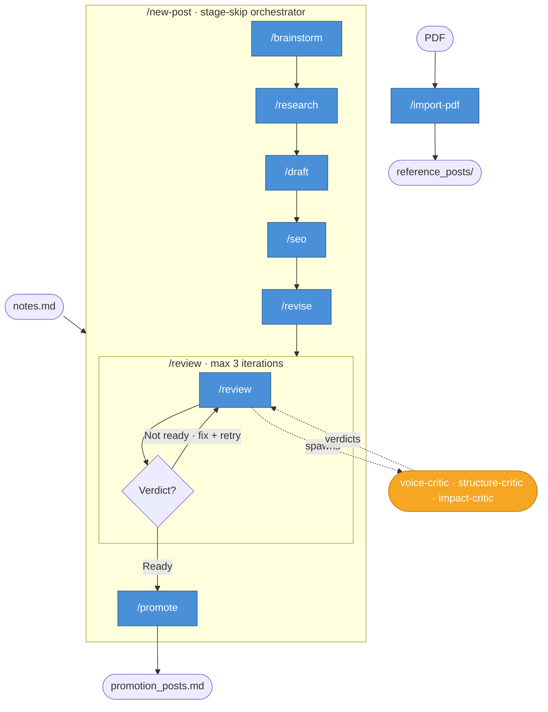

# Newsletter Engine

A repo-based, Claude-first writing system for creating blog and newsletter content. Specialised agents handle brainstorming, research, drafting, SEO, and promotion — coordinated by Claude across a predictable folder structure.

---

## Pipeline


```mermaid
flowchart TD
    PDF([PDF]) --> IP["/import-pdf"]
    IP --> RP([reference_posts/])

    NOTES([notes.md]) --> NP

    subgraph NP ["/new-post  ·  stage-skip orchestrator"]
        B["/brainstorm"] --> C["/research"]
        C --> D["/draft"]
        D --> E["/seo"]
        E --> F["/revise"]
        F --> RLOOP

        subgraph RLOOP ["/review  ·  max 3 iterations"]
            direction LR
            G["/review"] --> VRD{Verdict?}
            VRD -- "Not ready · fix + retry" --> G
        end

        VRD -- Ready --> PR["/promote"]
    end

    G -.->|spawns| CRITICS(["voice-critic · structure-critic · impact-critic"])
    CRITICS -.->|verdicts| G

    PR --> BUNDLE([promotion_posts.md])

    classDef skill fill:#4A90D9,stroke:#2C5F8A,color:#fff
    classDef agent fill:#F5A623,stroke:#C47D0E,color:#fff
    class B,C,D,E,F,G,PR,IP skill
    class CRITICS agent
```

Each skill is independently invocable. `/new-post` chains all stages unattended with stage-skip logic. `/import-pdf` is a standalone utility for importing reference posts.

| Stage | Produces |
|-------|----------|
| `/brainstorm` | `post.yaml` |
| `/research` | `research_brief.md` |
| `/draft` | `outline.md`, `long_draft.md` |
| `/seo` | `seo_brief.md` |
| `/revise` | `long_draft.md` (revised), `long_draft_v1.md` (backup), `seo_brief.md` (section 12 appended) |
| `/review` | `review_report.md` |
| `/promote` | `promotion_posts.md` |
| `/new-post` | `decision_log.md`, `skill_reflection_log.md` (via hooks) |
| `/index` | `posts/INDEX.md` (appended) |

---

## Repo Structure

```
newsletter-engine/
├── .claude/
│   ├── CLAUDE.md                  # Session context and repo index
│   ├── rules/                     # Behavioural rules, auto-loaded
│   ├── agents/                    # Critic agent definitions (voice, structure, impact)
│   ├── hooks/                     # Automation hooks (skill-reflector, detect-skill-complete)
│   └── skills/                    # Skill instruction files
│       ├── import-pdf/            # /import-pdf
│       ├── new-post/              # /new-post — full pipeline orchestrator
│       ├── brainstorm/            # /brainstorm
│       ├── research/              # /research
│       ├── draft/                 # /draft
│       ├── seo/                   # /seo
│       ├── revise/                # /revise
│       ├── review/                # /review — multi-agent editorial gate
│       ├── promote/               # /promote
│       └── index/                 # /index — post ledger
├── reference_posts/               # Jose's real posts for style grounding
│   ├── series/
│   ├── standalone/
│   └── short_technical/
├── style_guide/
│   ├── shared/                    # voice.md, anti_patterns.md
│   ├── types/                     # Per-type structure rules
│   └── promotion_formats.md       # Launch post + section deep-dive templates
├── templates/                     # post.yaml template, notes.md placeholder
└── posts/
    └── <slug>/
        ├── post.yaml              # Shared state — brainstorm output + pipeline stage flags
        ├── notes.md
        ├── research_brief.md
        ├── outline.md
        ├── long_draft.md
        ├── long_draft_v1.md       # Pre-revision backup (created by /revise)
        ├── seo_brief.md
        ├── review_report.md       # Panel consensus + 6-dimension scores (created by /review)
        ├── promotion_posts.md
        ├── decision_log.md        # Append-only pipeline run log
        └── skill_reflection_log.md  # Appended by skill-reflector hook after each stage
├── posts/
│   └── INDEX.md                   # Post ledger — agent entry point for content discovery
```

---

## Requirements

| Requirement | Purpose | Install |
|-------------|---------|---------|
| [Claude Code](https://claude.ai/code) | Primary interface | See Claude Code docs |
| `context-mode` MCP | Context window management | See Claude Code MCP docs |
| `WebSearch` tool | Grounded research | Built into Claude Code |
| `poppler` | PDF → text conversion for `/import-pdf` | `brew install poppler` |

---

## Milestones

| Milestone | Skill | Status |
|-----------|-------|--------|
| M0 — Foundation | — | ✓ Complete |
| M1 — Brainstorm | `/brainstorm` | ✓ Complete |
| M2 — Research | `/research` | ✓ Complete |
| M3 — Draft | `/draft` | ✓ Complete |
| M4 — SEO | `/seo` | ✓ Complete |
| M5 — Promotion | `/promote` | ✓ Complete |
| M6 — Full Pipeline | `/revise` + `/new-post` | ✓ Complete |
| M7 — Review | `/review` | ✓ Complete |
| M8 — Ideation | `/ideate` | Pending |

See `CLAUDE.md` for architectural principles and `reference-docs/` history is archived in git.
