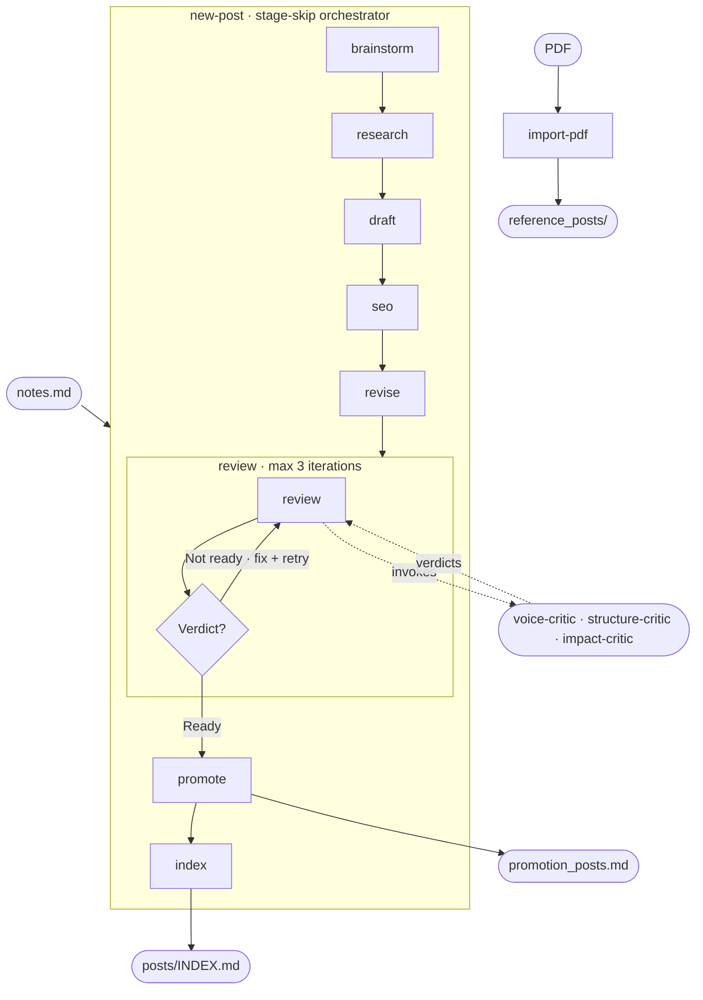

# Newsletter Engine

A repo-based writing system for creating blog and newsletter content. The workflow runs from durable repo files, coordinating specialised agents across a repeatable content pipeline.

## Pipeline


```mermaid
flowchart TD
    PDF([PDF]) --> IP[import-pdf]
    IP --> RP([reference_posts/])

    NOTES([notes.md]) --> NP

    subgraph NP [new-post · stage-skip orchestrator]
        B[brainstorm] --> C[research]
        C --> D[draft]
        D --> E[seo]
        E --> F[revise]
        F --> RLOOP

        subgraph RLOOP [review · max 3 iterations]
            direction LR
            G[review] --> VRD{Verdict?}
            VRD -- "Not ready · fix + retry" --> G
        end

        VRD -- Ready --> PR[promote]
        PR --> IDX[index]
    end

    G -.->|invokes| CRITICS([voice-critic · structure-critic · impact-critic])
    CRITICS -.->|verdicts| G

    PR --> BUNDLE([promotion_posts.md])
    IDX --> IDXF([posts/INDEX.md])
```

Each skill is independently invocable through the runtime's skill discovery. `new-post` chains all stages with stage-skip logic. `import-pdf` is a standalone utility for importing reference posts.

| Stage | Produces |
|-------|----------|
| brainstorm | `post.yaml` |
| research | `research_brief.md` |
| draft | `outline.md`, `long_draft.md` |
| seo | `seo_brief.md` |
| revise | `long_draft.md` (revised), `long_draft_pre-revise.md` (backup), `seo_brief.md` (verification appended) |
| review | `review_report.md` |
| promote | `promotion_posts.md` |
| new-post | `decision_log.md` |
| index | `posts/INDEX.md`, `posts/index/<topic>.md` |

## Repo structure

```
newsletter-engine/
├── AGENTS.md                      # Operating manual and workflow rules
├── opencode.json                  # Optional OpenCode project configuration
├── .opencode/
│   ├── agents/                    # Critic agent definitions
│   └── skills/                    # Skill instruction files
│       ├── import-pdf/
│       ├── new-post/
│       ├── brainstorm/
│       ├── research/
│       ├── draft/
│       ├── seo/
│       ├── revise/
│       ├── review/
│       ├── promote/
│       └── index/
├── archive/claude-code/           # Retired runtime assets and restoration guide
├── reference_posts/               # Jose's real posts for style grounding
├── style_guide/                   # Shared and type-specific writing rules
├── templates/                     # Post-folder templates
└── posts/
    ├── INDEX.md                   # Topic overview
    ├── index/                     # Detailed per-topic cards
    └── <slug>/                    # Working files for each post
```

## Requirements

### Portable core

- Markdown-readable skill, agent, guide, and reference files
- Ability to read and write files in `posts/<slug>/`
- Ability to update `post.yaml` and stage artefacts
- `poppler` for PDF conversion used by `import-pdf` (`brew install poppler`)

### OpenCode adapter

- OpenCode skill discovery for `.opencode/skills/`
- Optional native subagents for critic and analysis work; skills include sequential fallbacks
- `webfetch` for known URLs and research search fallback
- Optional `websearch` for open-ended research queries

The durable file contracts remain usable by any agent that can read Markdown and update repository files. See [AGENTS.md](AGENTS.md) for the complete operating manual.
